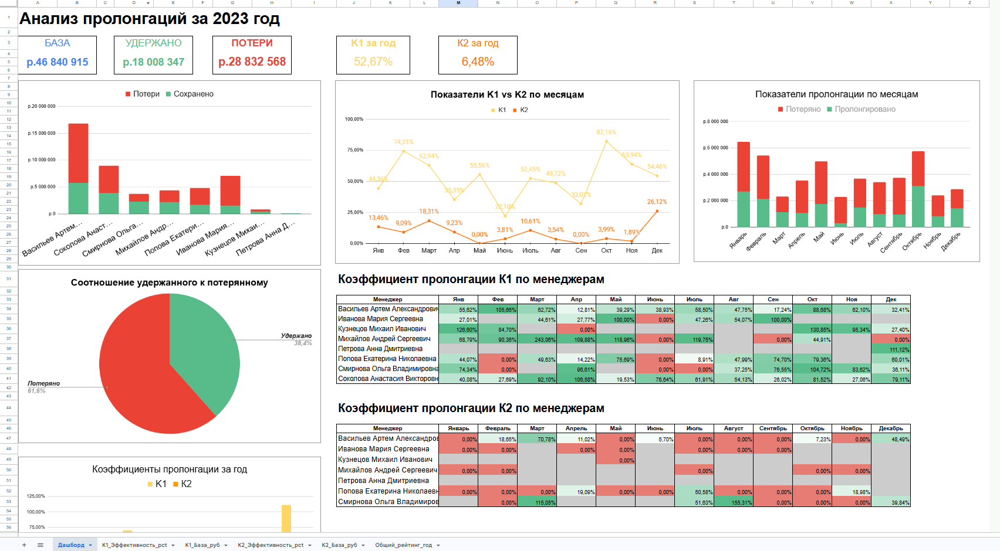
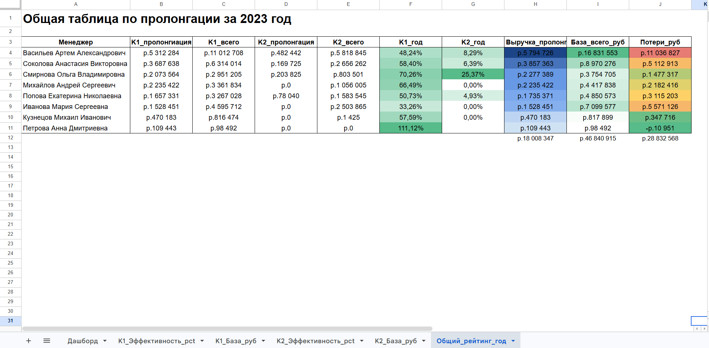

# Анализ пролонгаций аккаунт-менеджеров за 2023 год

Расчёт коэффициентов пролонгации договоров по отделу сопровождения клиентов и построение управленческого отчёта для руководителя отдела.

> Проект выполнен как **тестовое задание на позицию Data Analyst** (по итогам приглашён на технический собеседование). Данные синтетические: ФИО и суммы сгенерированы, реальной коммерческой информации не содержат.



---

## Бизнес-задача

Руководитель отдела сопровождения хотел понять, насколько эффективно аккаунт-менеджеры справляются с пролонгацией договоров — удержанием клиентов после завершения проекта. Нужен был отчёт за 2023 год, на основе которого можно принимать управленческие решения: кого подтянуть, где системные проблемы, сколько денег теряется.

Компания измеряет пролонгацию двумя коэффициентами:

- **K1 — удержание в первый месяц.** Отношение суммы отгрузки проектов, пролонгированных в первый месяц после завершения, к сумме отгрузки всех завершившихся проектов за предыдущий месяц.
- **K2 — возврат во второй месяц.** Отношение суммы отгрузки проектов, вернувшихся на второй месяц, к сумме отгрузки проектов, которые НЕ пролонгировались в первый месяц.

Коэффициенты считаются в трёх разрезах: по каждому менеджеру, по отделу в целом, помесячно и за год.

---

## Данные и их сложности

Работа велась с двумя «грязными» выгрузками, и значительная часть задачи — привести их в пригодный для расчёта вид:

- **Дубли строк** по одному `id` проекта (разные части оплаты) — потребовалась группировка с корректным суммированием.
- **Текстовые маркеры внутри числовых колонок:**
  - `стоп` / `end` — проект закрыт досрочно; такие проекты исключаются из расчёта пролонгации.
  - `в ноль` — отгрузка в месяце равна нулю; для базы коэффициента берётся отгрузка предыдущего месяца.
- **Расхождение источников** — поле ответственного менеджера в двух файлах не всегда совпадает; за основу взят `prolongations.csv` согласно ТЗ.

Очистка вынесена в отдельную функцию (`clean_currency`) и блок отсева проектов по статусам — это основная инженерная часть работы.

---

## Что в отчёте

Управленческий дашборд (Google Sheets) построен по принципу «читается за 10 секунд»:

- **Сводка сверху:** общая база пролонгации, удержано, потери (в рублях) и итоговые K1 / K2 за год.
- **Графики:** динамика K1 и K2 по месяцам, потери vs удержано по менеджерам, соотношение удержано/потеряно.
- **Тепловые карты по менеджерам** (K1 и K2, помесячно + итог за год) — мгновенно видно сильных и слабых.
- **Таблицы в рублях** — база возможной пролонгации и фактические потери по каждому менеджеру.

Принципы оформления: одна метрика — один цвет на всём отчёте; крупный читаемый размер; везде связка «процент + абсолютная сумма», чтобы руководитель видел не только эффективность, но и деньги за ней.



---

## Ключевые выводы

- **Отдел удерживает чуть больше половины выручки в первый месяц (K1 = 52,7%), но возврат во второй месяц практически не работает (K2 = 6,5%).** Это не проблема отдельных людей — низкий K2 системный почти у всех, а значит, точка роста на уровне процесса, а не отдельных менеджеров.
- **В деньгах:** из 46,8 млн ₽ потенциальной пролонгации удержано 18,0 млн, потеряно 28,8 млн — то есть ~62% возможной выручки утекает на непролонгациях.
- **Разброс между менеджерами по K1 значимый** — что даёт руководителю конкретный список, с кем работать, а кого ставить в пример.
- **Коэффициент выше 100% — это успех, а не ошибка:** он означает, что менеджер не просто удержал клиента, а заключил договор на бОльшую сумму (апсейл). Такие результаты стоит отмечать и тиражировать. Важная оговорка при чтении: коэффициент нужно смотреть в связке с объёмом базы — устойчивый высокий K1 на большом потоке проектов (например, годовой K1 ~66% при базе 4,4 млн ₽) и единичная удачная сделка, дающая формальные 111% при базе менее 100 тыс. ₽, — это разный по надёжности сигнал.

---

## Стек

- **Python:** pandas, numpy (расчёты и очистка), matplotlib, seaborn (визуализация)
- **Jupyter Notebook** — расчётная часть с пояснениями логики
- **Google Sheets** — итоговый управленческий отчёт
- Выгрузка результата также в **Excel (.xlsx)**

---

## Структура репозитория

```
prolongation-analysis/
├── README.md                         # этот файл
├── notebook.ipynb                    # расчёты с пояснениями
├── data/
│   ├── prolongations.csv
│   └── financial_data.csv
├── report/
│   ├── Отчет_пролонгация_2023.xlsx   # выгрузка из ноутбука
│   └── screenshots/                  # скриншоты дашборда
└── docs/
    └── задание.md                    # текст исходного ТЗ
```

---

## Как смотреть

- Бизнес-результат — в скриншотах дашборда (`report/screenshots/`) и в разделе «Ключевые выводы» выше.
- Логика расчётов с комментариями — в `notebook.ipynb`.
- Чтобы воспроизвести: положить `.csv` из `data/` рядом с ноутбуком и выполнить ячейки сверху вниз (нужен Python с pandas, numpy, matplotlib, seaborn).
